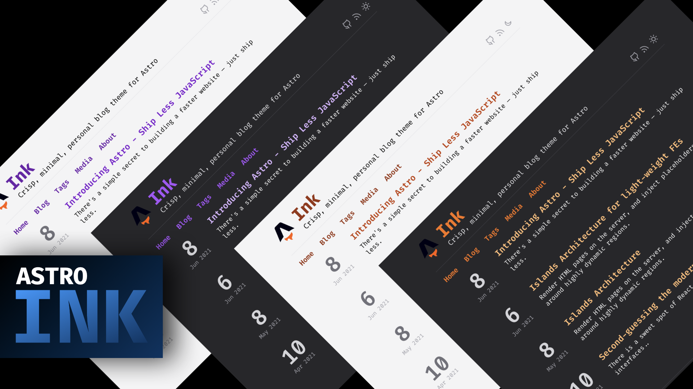

 

Astro Ink is a minimal theme created to serve minimalistic markdown-based blog needs. It ships with almost all the basic Astro components that you might need while creating light-weight, performant, personal blogs, that focus on shipping less Javascript by default.

 

 

  
  
  

 

It's hugely inspired by [Hugo](https://github.com/knadh/hugo-ink)'s Ink theme and strives to remain light, while providing the basis for a beautiful, minimal blog.

## Features
- __Minimal, Crisp, Markdown-Blog Ready__ always updated to Astro's latest (currently `2.x` release) under the hood.
- __Svelte Ready__ - In its effort to remain light-weight, performant, and more approachable from Astro's POV, Svelte is used for interactive components like the theme switcher
- __Modular__ - The structure is highly modular, with components doing just one job, and one job well.
- __Astro 2.0 Content Collection + Dynamic Pages__ - It's ready with Next.js like dynamic pages, to support a tag-based classification system with paginated results, all configurable
- __Dark Mode & Color Codes__ - It supports dark mode, and __6+__ color modes that's selected using `tailwind.config.js`. You can pass `THEME_KEY` with the `dev` or `build` script/commands ex: `THEME_KEY=purpleheart astro build/dev` to change the color theme being used. All the available themes can be found in [tailwind.theme.config.js](./tailwind.theme.config.js). To customize the blog section, add any of the Tailwind Typography's `prose-{color}` classes as referred [here](./src/components/Prose.astro)
- __Netlify CMS__ - Add/Edit/Update all the posts in the `/blog` directory by visiting `your-site.netlify.com/admin` ex: [astro-ink.netlify.app/admin](https://astro-ink.netlify.app/admin) with your Netlify credentials. It needs Netlify Identity(https://app.netlify.com/sites/your-site/settings/identity#registration
) and Git Gateway(https://app.netlify.com/sites/your-site/settings/identity#services) enabled.
- __Future Posts__(with Github Actions) - Create posts in the `/src/drafts` directory with a future `date` in the `YYYY-MM-DD` format, and let a specially crafted [Github Action](https://github.com/marketplace/actions/ssg-publish-drafts) take care of auto-publishing it on your specified date. You can configure the check interval in [Github Action](https://github.com/one-aalam/astro-ink/blob/main/.github/workflows/main.yml).
- __Client-Side Search__ - Allow your users get to your blog posts quickly with client-side search feat. Lunr.js
- __View counter feat. Redis/Upstash Redis__ - Configure your Redis host, place it's connection URL in your hosting provider's console (Vercel, Netlify, etc.) or in a `.env` file(local development), un-comment the connection code [here](./src/pages/api/blog/views/[slug].ts) and deploy. Your site's powered with a dynamic views counter. See [.env.example](./.env.example) to understand the different environment values you need to configure.
- __Media Page with YT channel support__ - Easily show your YT channel content on the media page by just putting your channel id in [config](./src/config.ts) file's `ytChannelId` constant. Optionally, disable the image thumbnails from your YT channel's video listing by setting `USE_MEDIA_THUMBNAIL` to `false`.
- __Author Cards__ - Easily add post based or site-wide Author cards, that include a Twitter follow button by setting `USE_AUTHOR_CARD` to `true` inside  [config](./src/config.ts) file.
- __Themed image overlay__ - You can optionally enable overlays, that can add a nice themed gradient on top of your post images by setting `USE_POST_IMG_OVERLAY` to `true` inside [config](./src/config.ts) file.

## How to start?
*Just clone this template*, and start working from your clone. You have all the common NPM commands at your disposal like `dev`, `build`, etc. Refer [package.json](./package.json) to see a list of all the available commands.

**Note:** Use `npx degit one-aalam/astro-ink` to clone the template without any of the `git` history

**Note: This template genrates `server` (SSR ready) output by default. If you want `static` builds**
  - change `output` to `static` from `server` in [astro.config.js](./astro.config.mjs)
  - remove `adapter: vercel()`
  - remove the views counter [API](./src/pages/api/blog/views/[slug].json.ts)
  - set `USE_VIEW_STATS` to `false` inside [config.ts](./src/config.ts)

**Note: Before running `npm run dev` for the very first time -** 
- create a `.env` file by running `mv .env.example .env` (if you're on a Linux distro or Mac)
- set the `SITE_URI` variable as `SITE_URI=http://localhost:4321` (_where 4321 is the port at which your project is running_)

## Built with Astro Ink
- [jamesperkins.dev](https://www.jamesperkins.dev/) - Personal site of developer, YouTube instructor [James R Perkins](https://twitter.com/james_r_perkins)
- [highlandcows.github.io](https://highlandcows.github.io/) [Nick Jacob](https://github.com/njacobs5074)'s personal blog

> know a site built with Astro Ink? Let me know on [Twitter](https://twitter.com/aftabbuddy)

## Wanna learn Astro while building Ink?
This theme was initially built with first an alpha, and then a beta version of the `Astro` Framework. If you're just starting with `Astro`, you can actually learn `Astro` while building this very theme by following a series of blogs I've written that teaches you Astro ground-up!

Head over to `aalam.in/blog` and know
- [How to set Astro up and get it running with essential defaults for styling, prototyping, and incremental deployments](https://aalam.in/blog/astro-get-up-and-running)
- [Managing presentational components and creating Astro pages](https://aalam.in/blog/astro-and-site-strcuture)
- [Feeding local as well as remote data to the Astro pages](https://aalam.in/blog/astro-and-data)
- [Putting interactivity where you absolutely cannot do without it in Astro](https://aalam.in/blog/astro-and-interactivity)
- [Creating data-driven, dynamic pages and paginated results in Astro](https://aalam.in/blog/astro-and-dynamic-pages)
- [Author your Astro site's content with Git-based CMSs](https://aalam.in/blog/astro-and-git-cms-netlify)
